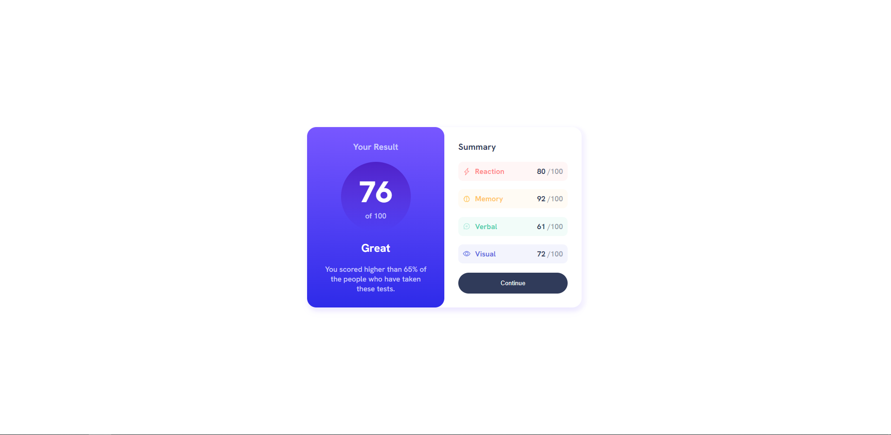

# Frontend Mentor - Results summary component solution

This is a solution to the [Results summary component challenge on Frontend Mentor](https://www.frontendmentor.io/challenges/results-summary-component-CE_K6s0maV). Frontend Mentor challenges help you improve your coding skills by building realistic projects.

## Table of contents

- [Overview](#overview)
  - [Screenshot](#screenshot)
  - [Links](#links)
- [My process](#my-process)
  - [Built with](#built-with)
  - [What I learned](#what-i-learned)
  - [Continued development](#continued-development)
  - [Useful resources](#useful-resources)
- [Author](#author)
- [Acknowledgments](#acknowledgments)

## Overview

### Screenshot

### Links

- Live Site URL: [Add live site URL here]()

## My process

### Built with

- ReactJS / NextJS
- SCSS
- Flexbox

### What I learned

- mapping objects in react
- react icons
- sass each function

### Continued development

### Useful resources

## Author

- Website - [Add your name here](https://www.your-site.com) **coming soon**
- Frontend Mentor - [@yourusername](https://www.frontendmentor.io/profile/Mikoyzskie)

**Note: Delete this note and add/remove/edit lines above based on what links you'd like to share.**

## Acknowledgments

- Free Code Camp - (https://www.freecodecamp.org/)
